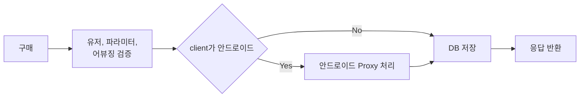
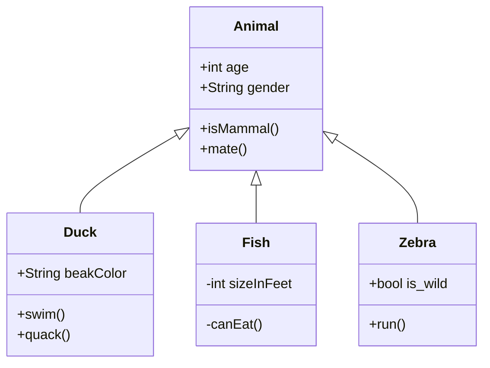

```mermaid
flowchart LR
    A[구매] --> B;
    B[유저, 파라미터, \n 어뷰징 검증] --> C;
    C{client가 안드로이드} -->|Yes| E;
    C -->|No| G;
    E[안드로이드 Proxy 처리] --> G;
    G[DB 저장] --> I;
    I[응답 반환];
```

```mermaid
 classDiagram
      Animal <|-- Duck
      Animal <|-- Fish
      Animal <|-- Zebra
      Animal : +int age
      Animal : +String gender
      Animal: +isMammal()
      Animal: +mate()
      class Duck{
          +String beakColor
          +swim()
          +quack()
      }
      class Fish{
          -int sizeInFeet
          -canEat()
      }
      class Zebra{
          +bool is_wild
          +run()
      }
```